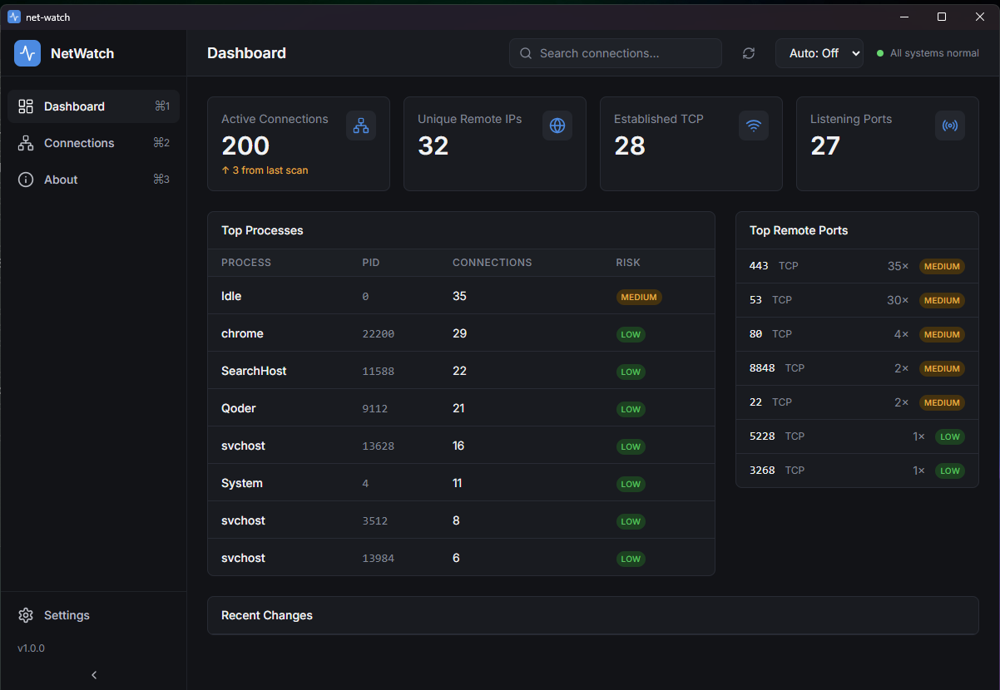
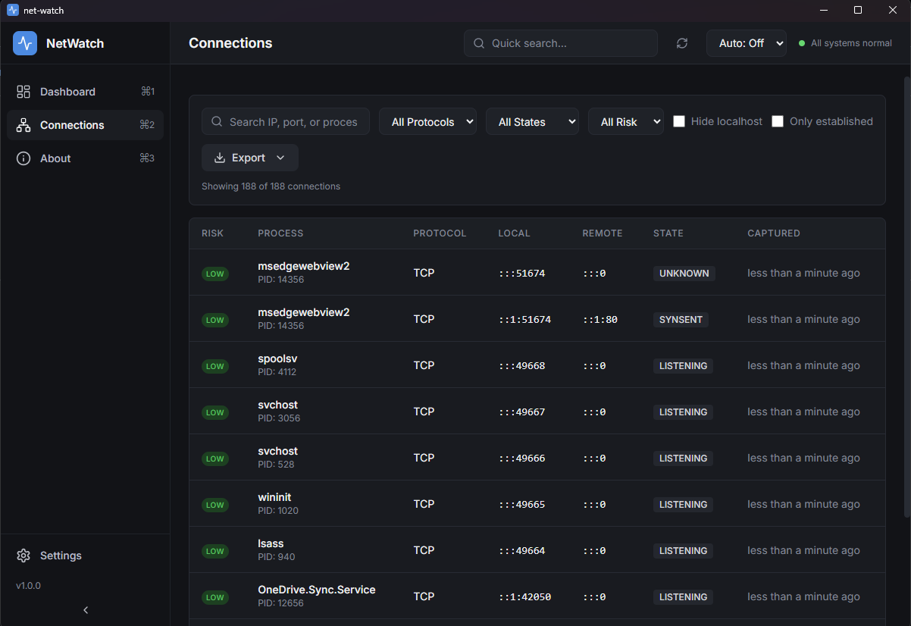

<h1 align="center">NetWatch 🌐</h1>

<p align="center">
  
</p>

<p align="center">
  <strong>A network monitoring application built with Tauri, Rust, and React</strong>
</p>

<p align="center">
  Real-time visibility into active network connections on your local machine with advanced risk assessment and intuitive UI.
</p>

---

## ✨ Features

- 🔍 **Real-time Monitoring** - Live tracking of TCP/UDP connections
- 👤 **Process Identification** - Maps connections to running processes with PID and process name
- ⚠️ **Risk Assessment** - Intelligent risk scoring (Low/Medium/High) based on connection characteristics
- 🔎 **Advanced Filtering** - Search, filter by protocol, state, risk level and more
- 💾 **Export Capabilities** - Export connection data to JSON/CSV formats
- 🔄 **Auto-refresh** - Automatic data refresh with configurable intervals (3s, 5s)
- 📊 **Dashboard View** - Summary cards and process statistics
- 🛡️ **Privacy Focused** - Monitors only your local machine, no external data transmission

## 📸 Screenshots

<div align="center">
  
  
</div>

## 🛠️ Tech Stack

- **Frontend**: React 18.3 + TypeScript 5.8 + Vite 7.0
- **Backend**: Rust 1.70+ with Tauri 2.x
- **UI Components**: Radix UI primitives with Tailwind CSS
- **Platform Integration**: PowerShell (Windows), with Linux/macOS support planned
- **Build Tool**: Vite + Tauri CLI

## 🚀 Getting Started

### Prerequisites

- Node.js 18+ 
- Rust 1.70+
- Windows PowerShell (for Windows platform support)

### Installation

1. **Clone and install dependencies:**
   ```bash
   git clone <repository-url>
   cd NetWatch
   npm install
   ```

2. **Run the development version:**
   ```bash
   npm run tauri dev
   ```

3. **To build a production version:**
   ```bash
   npm run tauri build
   ```

## 🌍 Platform Support

- **Windows**: ✅ **Fully supported** using PowerShell commands (`Get-NetTCPConnection`, `Get-NetUDPEndpoint`)
- **Linux**: 🔄 **Planned** support using `ss` or `netstat` commands  
- **macOS**: 🔄 **Planned** support using `lsof` or `netstat` commands

## 🏗️ Architecture

### Backend (Rust/Tauri)
- Collects network connection data using OS-specific commands
- Maps PIDs to process names with fallback mechanisms
- Calculates risk levels based on connection characteristics
- Provides secure Tauri commands for the frontend
- Robust error handling with comprehensive logging

### Frontend (React/TypeScript)
- Responsive UI with modern design patterns
- Sortable, filterable connection tables
- Advanced search and filtering capabilities
- Auto-refresh and manual refresh options
- Dashboard with summary statistics
- Process detail views with risk analysis

## 🎯 Commands

- `get_connections()` - Retrieves current network connections with risk assessment
- `export_connections(format, data)` - Exports connection data to specified format (JSON/CSV)

## ⚠️ Risk Assessment

The application uses an intelligent heuristic to assess connection risk:

- **High Risk**: Connections to known dangerous ports (23, 445, 3389, 5900, 3306, 27017, 4444, 1337, 6667) in ESTABLISHED state
- **Medium Risk**: Connections to administrative ports, unknown processes, or non-standard high ports
- **Low Risk**: Standard connections to known services
- **Dynamic Scoring**: Adjusts based on connection state, port, and process ownership

## 🛡️ Security

This application is designed for local network monitoring only. It does not:
- Send data to external servers
- Access network packet contents
- Perform network scanning beyond local connections
- Execute arbitrary shell commands with user input

All system commands are constructed with fixed scripts and safe parameter passing.

## 🤝 Contributing

Contributions are welcome! Feel free to submit a Pull Request. For major changes, please open an issue first to discuss what you would like to change.

## 📄 License

This project is licensed under the MIT License - see the [LICENSE](LICENSE) file for details.

## 🙏 Acknowledgments

- Built with [Tauri](https://tauri.app/) for secure native applications
- UI powered by [Radix UI](https://www.radix-ui.com/) and [Tailwind CSS](https://tailwindcss.com/)
- Icons from [Lucide](https://lucide.dev/)